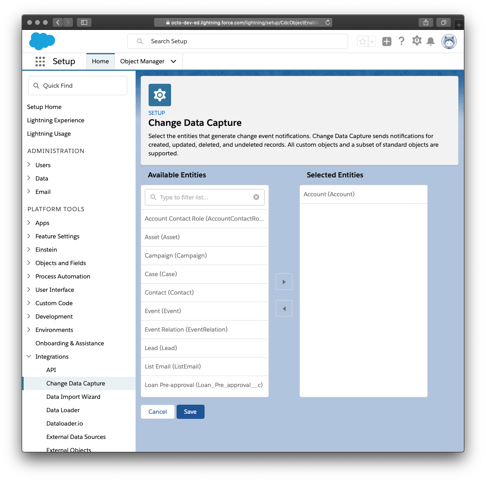

🚧🔬 **Work in progress. Not yet functional.**

# Salesforce streams with Node.js

**This example app displays a feed of changes happening within a Salesforce org.**

🤐🚫🙅‍♀️ *Do not connect this app with a production Salesforce org without proper security review. This app receives potentially confidental data from the Salesforce org via Streaming API.*

[](https://heroku.com/deploy)

## Architecture

This app is composed of two processes: a single-process [Stream Consumer](stream-consumer.js) and a [scalable Web app](server.js).


Messages flow from Salesforce to the Stream Consumer via [Bayeux/CometD](https://developer.salesforce.com/docs/atlas.en-us.api_streaming.meta/api_streaming/BayeauxProtocolAndCometD.htm#!), and then pushed through [Redis pub/sub](https://redis.io/topics/pubsub) to each individual Web client via [Server-Sent Events](https://developer.mozilla.org/en-US/docs/Web/API/Server-sent_events).

The Stream Consumer is a single, single-threaded process to reliably ingest the ordered stream from Salesforce. Redis acts as a bridge to support scalable processing of the messages by multiple clients. In this example, we use Redis [`PUBLISH`/`SUBSCRIBE`](https://redis.io/topics/pubsub) to send every web client the complete stream. To instead provide a reliable queue of messages for scalable processing, pub/sub could be replaced with Redis [`LPUSH`/`RPOPLPUSH`/`LREM`](https://redis.io/commands/rpoplpush#pattern-reliable-queue).

This example app uses the [Change Data Capture (CDC)](https://developer.salesforce.com/docs/atlas.en-us.216.0.change_data_capture.meta/change_data_capture/cdc_intro.htm) stream for **Accounts**, which must be enabled for each desired object in Salesforce Setup:



## Local development

### Requires

* Salesforce
  * [a free Developer Edition org](https://developer.salesforce.com/signup)
* Heroku
  * [a free account](https://signup.heroku.com)
  * [command-line tools (CLI)](https://devcenter.heroku.com/articles/heroku-command-line)
* [redis server](https://redis.io/download) (installed and listening on the default local port)
* [git](https://git-scm.com/book/en/v2/Getting-Started-Installing-Git)
* [Node.js](https://nodejs.org) 10.x

### Setup

In your shell terminal, clone this repo to become the working directory:

```bash
git clone https://github.com/mars/salesforce-streams-nodejs
cd salesforce-streams-nodejs
```

Install Node packages:

```bash
npm install
```

Copy the local dev environment variables template, and then open `.env` in your editor:

```
cp .env.sample .env
```

✏️ *In `.env` [configure Salesforce authentication](#user-content-salesforce-authentication).*

### Salesforce

Login to the Salesforce org.

In **Salesforce Setup** → **Integrations** → **Change Data Capture**, select which entities (objects) should produce change messages.

For this example app, **Account** is selected.

### Running

The app is composed of two processes, declared in the [`Procfile`](Procfile). It may be start using the follow commands:

```bash
# First run, use -2 replay to get all retained 
# streaming messages from Salesforce.
REPLAY_ID=-2 heroku local

# After that, simply run the web & stream processes
# as declared in Procfile (like Heroku uses for deployment):
heroku local

# Alternatively, run production-style pre-compiled web app
# (requires rebuilding to see changes):
npm run build
NODE_ENV=production heroku local
```

### Demo

▶️ in a browser view the web UI [http://localhost:3000/](http://localhost:3000/).

▶️ in a separate browser window, login to the associated Salesforce org. Create or update entities that have been [configured](#user-content-salesforce).

👀 observe the changes appearing in the web UI.

### Testing

Tested with [ava](https://github.com/avajs/ava):

```bash
npm test
```

## Configuration

Configured via environment variables.

For local development, set these values in `.env` file.

For Heroku deployment, set these values via [Config Vars](https://devcenter.heroku.com/articles/config-vars).

### Salesforce Authentication

**required**

Any one of the following authentication methods must be used by setting its variables:

* Username + password
  * `SALESFORCE_USERNAME`
  * `SALESFORCE_PASSWORD` (the password and security token combined without spaces)
  * `SALESFORCE_LOGIN_URL` (optional; defaults to **login.salesforce.com**)
* Existing OAuth token
  * `SALESFORCE_INSTANCE_URL`
  * `SALESFORCE_ACCESS_TOKEN`
  * Retrieve from an [sfdx](https://developer.salesforce.com/docs/atlas.en-us.212.0.sfdx_dev.meta/sfdx_dev/sfdx_dev_intro.htm) scratch org with `sfdx force:org:display`
* OAuth client
  * `SALESFORCE_URL`
    * *Must include oAuth client ID, secret, & refresh token*
    * Example: `force://{client-id}:{secret}:{refresh-token}@{instance-name}.salesforce.com`

### Runtime Behavior

* `FORCE_API_VERSION`
  * Salesforce API version
* `OBSERVE_SALESFORCE_TOPIC_NAMES`
  * **required**
  * the path part of a Streaming API URL
  * a comma-delimited list
  * example: `OBSERVE_SALESFORCE_TOPIC_NAMES=/event/Heroku_Function_Generate_UUID_Invoke__e`
* `REDIS_URL`
  * **required**
  * connection config to Redis datastore
  * example: `REDIS_URL=redis://localhost:6379`
  * default: should be set from Heroku Redis add-on
* `REPLAY_ID`
  * force a specific replayId for Salesforce Streaming API
  * ensure to unset this after usage to prevent the stream from sticking
  * example: `REPLAY_ID=5678` (or `-2` for all possible events)
  * default: unset, receive all new events

